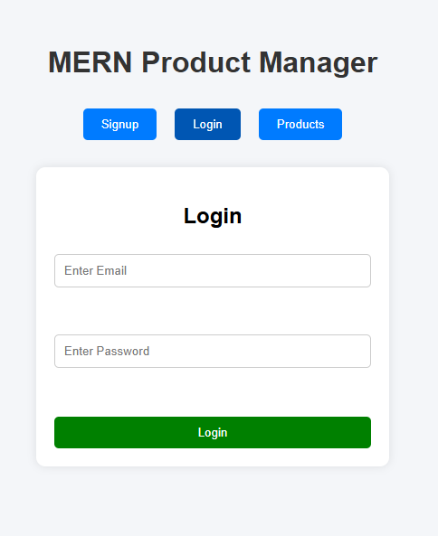
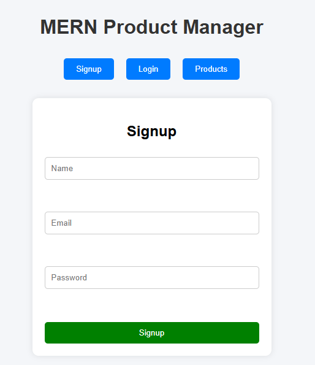
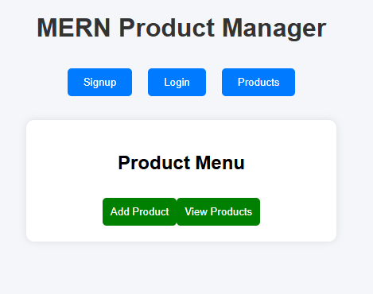
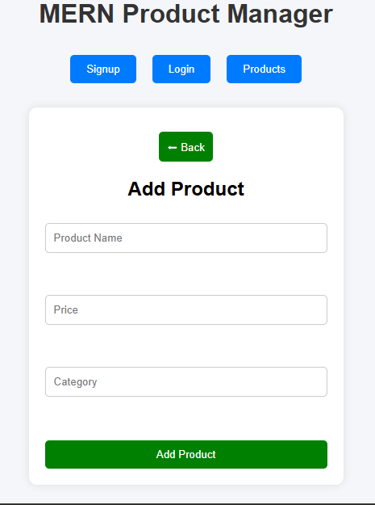
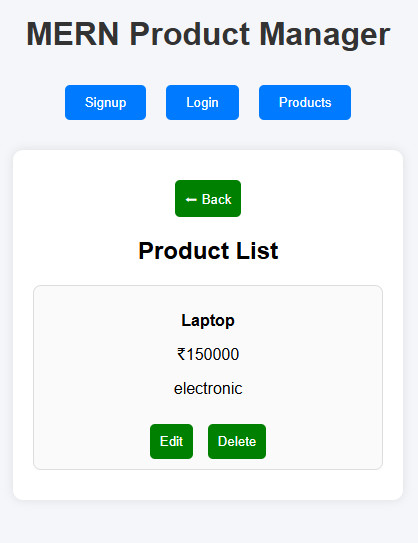

1) MERN Auth App

A full-stack authentication system built using the MERN stack (MongoDB, Express, React, Node.js). This project provides secure user authentication with login, registration, and JWT-based authorization.

2) Features

 User Registration
 User Login
 JWT Authentication
 Protected Routes
 REST API Integration
 Frontend + Backend Connected

3) Tech Stack

  Frontend:** React.js
  Backend:** Node.js, Express.js
  Database:** MongoDB
  Authentication:** JWT (JSON Web Token)

4) Project Structure
bash id="ps1"/auth-mern-app/
│
├── backend/
│   ├── models/
│   ├── routes/
│   ├── controllers/
│   └── index.js
│
├── frontend/
│   ├── src/
│   └── public/
│
└── README.md

5) Installation & Setup

i) Clone the repository
git clone https://github.com/prathameshnevase158-debug/mern-auth-app.git
cd mern-auth-app

ii) Backend Setup
cd backend
npm install

iii) Create a .env file and add:
PORT=8000
MONGO_URI=your_mongodb_connection_string
JWT_SECRET=your_secret_key

iv) Run backend:
npm start

v) Frontend Setup
cd frontend
npm install
npm start

6)API Endpoints

| Method | Endpoint  | Description     |
| ------ | --------- | --------------- |
| POST   | /register | Register user   |
| POST   | /login    | Login user      |
| GET    | /profile  | Protected route |

7) Screenshots
 i) Login Page

 

ii) Sign Up Page
   
  

     
iii) Product Menu
  
  

iv) Add Product
     

 v) View Product
    
8) Author
      Prathamesh Nevase

9) Support
If you like this project, give it a  on GitHub!
